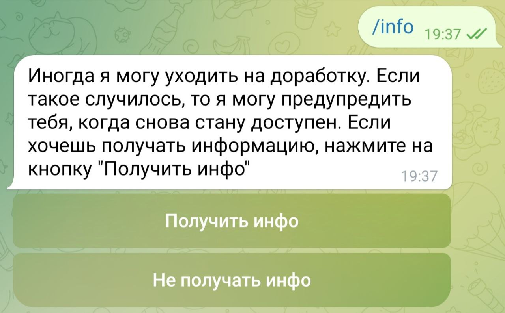
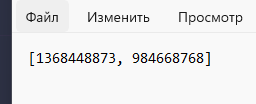

# My Cute AI

My Cute AI — бот, созданный на основе Mistral AI, который предоставляет базовый функционал для взаимодействия с пользователями через команды /start, /help и /info.

## Основные команды

- /start: Начало взаимодействия с ботом.
- /help: Отображение списка доступных команд и их описания.
- /info: Подписка на обновление бота.
- /history: История запросов.
- /find_job: Поиск работы на основе предпочтений пользователя
- /subscribe: Подписка на ежедневную рассылку вакансий на основе последнего запроса пользователя.

## Используемые онлайн-сервисы

https://docs.mistral.ai/ - Mistral AI API
https://api.hh.ru/openapi/redoc - HH API


## API HH

CURL GET https://api.hh.ru/areas

Запрос без параметров:

```json
[
  {
    "id": "113",
    "parent_id": null,
    "name": "Россия",
    "areas": [
      {
        "id": "1620",
        "parent_id": "113",
        "name": "Республика Марий Эл",
        "areas": [
          {
            "id": "4228",
            "parent_id": "1620",
            "name": "Виловатово",
            "areas": []
          },
          next_areas...
```

CURL GET https://api.hh.ru/vacancies

```json
{
  "items": [
    {
      "id": "108144503",
      "premium": false,
      "name": "Диспетчер чатов (в Яндекс)",
      "department": null,
      "has_test": false,
      "response_letter_required": false,
      "area": {
        "id": "113",
        "name": "Россия",
        "url": "https://api.hh.ru/areas/113"
      },
      "salary": {
        "from": 30000,
        "to": 44000,
        "currency": "RUR",
        "gross": true
      },
      "type": {
        "id": "open",
        "name": "Открытая"
      },
      "address": null,
      "response_url": null,
      "sort_point_distance": null,
      "published_at": "2024-10-03T18:33:14+0300",
      "created_at": "2024-10-03T18:33:14+0300",
      "archived": false,
      "apply_alternate_url": "https://hh.ru/applicant/vacancy_response?vacancyId=108144503",
      "show_logo_in_search": null,
      "insider_interview": null,
      "url": "https://api.hh.ru/vacancies/108144503?host=hh.ru",
      "alternate_url": "https://hh.ru/vacancy/108144503",
      "relations": [],
      "employer": {
        "id": "9498120",
        "name": "Яндекс Команда для бизнеса",
        "url": "https://api.hh.ru/employers/9498120",
        "alternate_url": "https://hh.ru/employer/9498120",
        "logo_urls": {
          "original": "https://img.hhcdn.ru/employer-logo-original/1121425.jpg",
          "90": "https://img.hhcdn.ru/employer-logo/6106293.jpeg",
          "240": "https://img.hhcdn.ru/employer-logo/6106294.jpeg"
        },
        "vacancies_url": "https://api.hh.ru/vacancies?employer_id=9498120",
        "accredited_it_employer": false,
        "trusted": true
      },
      "snippet": {
        "requirement": "Способен работать в команде. Способен принимать решения самостоятельно. Готов учиться и узнавать новое. Опыт работы в колл-центре или службе...",
        "responsibility": "Работать с клиентами или партнерами для решения разнообразных ситуаций. Развивать процессы и инструменты для улучшения качества сервисов."
      },
      "contacts": null,
      "schedule": {
        "id": "remote",
        "name": "Удаленная работа"
      },
      "working_days": [],
      "working_time_intervals": [
        {
          "id": "from_four_to_six_hours_in_a_day",
          "name": "Можно сменами по 4-6 часов в день"
        }
      ],
      "working_time_modes": [],
      "accept_temporary": false,
      "professional_roles": [
        {
          "id": "40",
          "name": "Другое"
        }
      ],
      "accept_incomplete_resumes": true,
      "experience": {
        "id": "noExperience",
        "name": "Нет опыта"
      },
      "employment": {
        "id": "full",
        "name": "Полная занятость"
      },
      "adv_response_url": null,
      "is_adv_vacancy": false,
      "adv_context": null
    }
```


## Установка и запуск

### Шаг 1: Клонирование репозитория

Сначала клонируйте репозиторий с кодом бота:

git clone https://gitlab.skillbox.ru/adelina_pavlova/python_basic_diploma.git

### Шаг 2: Установка зависимостей

Убедитесь, что у вас установлен Python и pip. Затем установите необходимые зависимости:
pip install -r requirements.txt

### Шаг 3: Настройка бота

Создайте файл .env в корневом каталоге проекта и добавьте туда следующие переменные окружения:
BOT_TOKEN=Ваш_Telegram_Bot_Token

### Шаг 4: Запуск бота

Теперь вы можете запустить бота:

python main.py


## Базовый функционал

- /start: Начало взаимодействия с ботом. Информация.
- /help: Помощь.
- /info Подписка на обновления бота.
- /history История запросов.

## Работа программы

1. Команда /start:
На этом этапе пользователь регистрируется, а данные а его имени, телеграмм айди и телефоне отправляются в базу данных.


2. Команда /info:
Собирает данные об телеграмм айди пользователя при нажатии на кнопку "Получить инфо", а затем заносит их в .json файл для того чтобы позже рассылать информацию о появлении бота онлайн.



.json файл:



3. Команда /help:
Отправляет пользователю инфо о функционале бота.


4. Команда /find_job:
Опрашивает пользователя, и, используя api headhunter.ru, выдает ему вакансии, отвечающие его запросу. Пользователь получает 10 вакансий, а благодаря тому, что реализована пагинация, он может перелистывать страницы, получая каждый раз 10 следующих вакансий.


Так выглядит каждая вакансия, полученная пользователем.


Пагинация:


5. Команда /history:
Выдает историю запросов пользователя из базы данных.


6. Команда /subscribe:
Это команда для подписки пользователя на ежедневную рассылку новых вакансий на основе его последнего запроса. Бот спрашивает разрешение на подписку, затем уточняет время, в которое пользователь хотел бы ее получать, после чего эта информация записывается в базу данных. Каждый день в выбранное время пользователь получает 10 новых вакансий.


## Контакты

Если у вас есть вопросы или предложения, пожалуйста, свяжитесь со мной:

- Email: eswenna@gmail.com
- Telegram: @candydragon_cg


